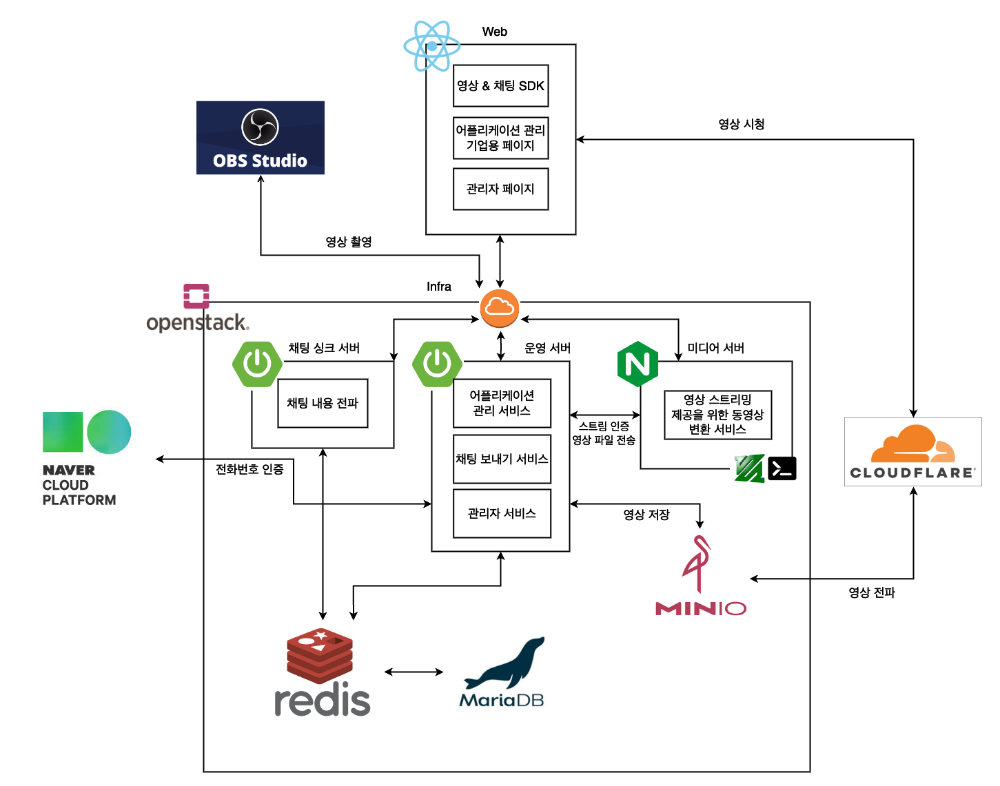

<div align=center>
		
</div>
<div align=center>
	<h3>📚 Tech Stack 📚</h3>
	<p>✨ Platforms & Languages ✨</p>
</div>
<div align="center">
	
	
	
    
    
</div>
<br>
<div align=center>
	<p>🛠 Tools 🛠</p>
</div>
<div align=center>
	
	
</div>
<br>

## 개요
4학년 2학기 SW캡스톤디자인 "실시간 라이브 스트리밍 SaaS" 프로젝트 중, 운영 서버 프로젝트입니다.
<br/>
<br/>

## 서비스 아키텍쳐
<div align="center">
    
</div>

운영 서버는 여러 소프트웨어 컴포넌트를 통합·관리하는 역할을 맡고 있습니다. 이러한 역할을 맡고 있음에 대한 이해를 돕고자 전체 서비스 아키텍쳐로 표현하였습니다.

## 핵심 기능
+ InStream 기업 서비스 제공
  + 영상, 채팅 어플리케이션 생성 및 관리
  + 어플리케이션 사용에 대한 인증 인가 (영상 - 미디어 서버, 채팅 - 채팅 싱크 서버)
  + 사용량 내역 조회 및 결제
  + InStream 서비스 관련 문의하기
  + 관리자 서비스
+ 영상 저장
  + Nginx 미디어 서버로부터 HLS 파일 업로드 요청을 처리
  + Nginx 미디어 서버의 세션 강제 종료 (개발 예정)
+ 채팅
  + 클라이언트의 채팅을 redis에 publish

## 서버 실행

프로젝트 루트 경로에 .env 파일을 생성하고 다음과 같이 파일 내용을 작성합니다.
```dotenv
# .env
MARIA_IP=mariadb # Docker Network 기준
MARIA_PORT=3306 # Docker Network 기준
MARIA_DATABASE=your_maria_database
MARIA_USERNAME=your_maria_username
MARIA_PASSWORD=your_maria_password
MARIA_ROOT_PASSWORD=your_maria_root_password
REDIS_IP=redis # Docker Network 기준
REDIS_PORT=6379 # Docker Network 기준
REDIS_PASSWORD=your_redis_password 
```

이후 터미널에서 다음 명령어를 실행합니다.
```shell
# shell
./gradlew clean  build -x test --refresh-dependencies
docker build --tag instream-tenant-server .
docker-compose down
docker-compose up -d
```

